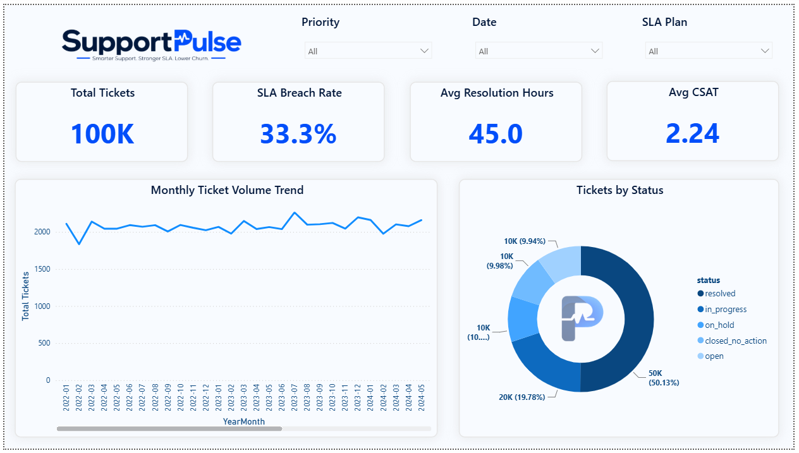
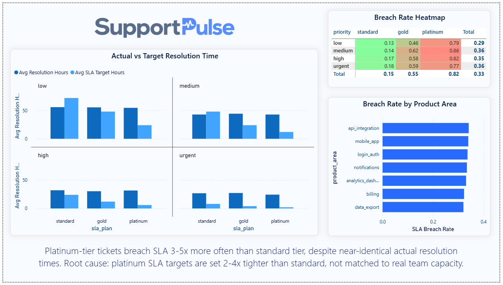
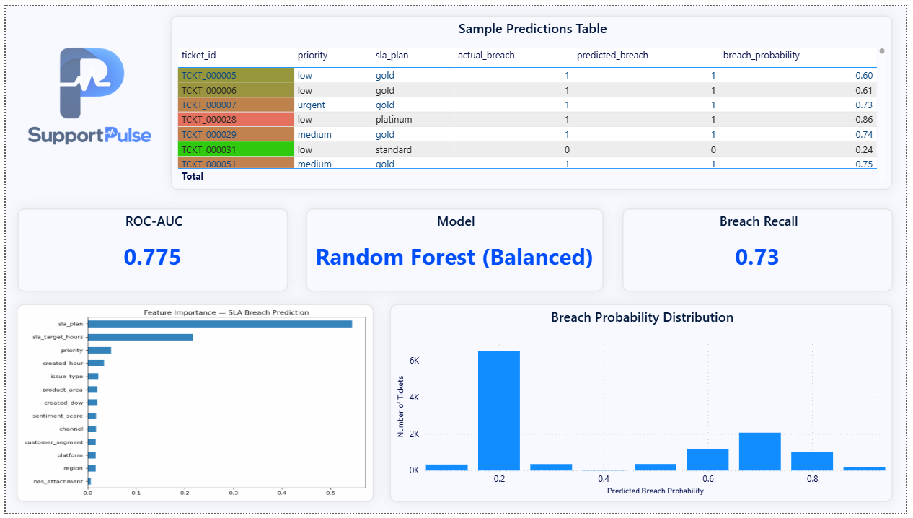

# SupportPulse — SaaS Helpdesk SLA & Agent Performance Analytics

**Analyzing 100,000 support tickets to uncover why premium-tier customers experience the highest SLA breach rates — and proving it's a target-design problem, not a service-quality problem.**



## Business Problem

DeskPulse Cloud Solutions (fictional SaaS company) has no visibility into where its support SLA commitments are failing. Leadership needs to know: which ticket segments breach SLA most, whether sentiment predicts dissatisfaction, and whether breach risk can be predicted before it happens.

## Key Findings

1. **The "Platinum Paradox"** — Platinum-tier tickets breach SLA 3–5x more often than standard tier (up to 85.5% vs 13.1%), despite **nearly identical actual resolution times** across all plan tiers. Root cause: platinum SLA targets are set 2–4x tighter than the team's real operating speed.
2. **Priority × Plan tier is the dominant driver of breach risk.** Channel, customer segment, product area, and sentiment all show negligible effect (within 1–2 percentage points of the 33.3% baseline).
3. **Sentiment does not predict SLA outcomes.** Average sentiment, CSAT, and reopen rate are nearly identical between breached and non-breached tickets.
4. **Ticket volume is flat** — ~2,000–2,200/month since 2022, no growth trend. This is an SLA-design problem, not a scaling problem.
5. A **Random Forest classifier** predicts breach risk at ticket-creation time (ROC-AUC 0.775, 73% breach recall), with `sla_plan` + `sla_target_hours` explaining ~76% of predictive power — independently confirming Finding #1.

## Tech Stack

Python (pandas, scikit-learn) · SQL (SQLite) · Power BI · Excel (openpyxl)

## Project Structure

```
├── Dataset/             # Raw and cleaned ticket data
├── Jupyter_Notebooks/   # Cleaning, EDA, modeling notebooks
├── SQL/                 # SLA compliance, resolution time, sentiment queries
├── PowerBI/              # 3-page interactive dashboard
├── Models/               # Trained SLA-breach classifier
├── Outputs/              # Predictions, Excel executive workbook
├── Images/               # EDA charts, dashboard screenshots
├── Documentation/        # Business assumptions, methodology notes
└── Reports/               # Executive summary, final report
```


## Methodology

1. **Data Cleaning** — Handled structural nulls (non-terminal tickets), defined a custom SLA target matrix (no target column existed in raw data) documented in `Documentation/Notes/sla_assumptions.md`.
2. **SQL Analysis** — CTEs and window functions to quantify breach rates, resolution-time gaps, and sentiment relationships.
3. **EDA + Modeling** — Visualized the platinum paradox, engineered features, trained and compared Logistic Regression vs Random Forest (unweighted/balanced), selected balanced RF for its superior breach recall.
4. **Power BI Dashboard** — 3-page interactive report (Overview, SLA Deep-Dive, Breach Risk & Prediction).
5. **Excel Workbook** — Formula-driven executive summary for non-technical stakeholders.

## Dashboard Preview

| SLA Compliance Deep-Dive | Breach Risk & Prediction |
|---|---|
|  |  |

## Dataset

[Synthetic IT Support Tickets](https://www.kaggle.com/datasets/ahsanneural/synthetic-it-support-tickets) — Kaggle (100k rows)

## Author

Yaswanth | [LinkedIn](https://linkedin.com/in/yaswanthgunda0068) | [GitHub](https://github.com/yaswanth0068)